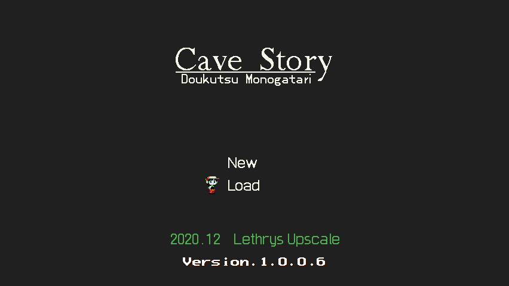

# Cave-Story-Lethrys-Upscale
A built-from-scratch, 2xRes upscale of Cave Story, intended for community use.

Features of this upscale:

- Base game is 100% complete, from Start Point to end credits, as well as a few (but not all) unused sprites
- Remains faithful to the original art style
- (Hopefully) free of asymmetrical sprites, leftover 1xRes pixels, and other weird inconsistencies seen in the Nicalis upscale
- Compatible with Freeware, CSE2, and Cave Story+
- Made for open community use

Instructions for enabling 2xRes:

Freeware:

Install Clownacy's .DLL mod loader and set sprite_resolution to '2' in /mods/graphics_enhancement/settings.ini

That, or use the Doukutsu2x executable if you somehow have it.

CSE2:

Step 1: Wait for Nicalis to allow CSE2 to exist again

After you have done that: In src/CommonDefines.h, set SPRITE_SCALE to '2', and compile using the instructions in the readme. This define only exists on enhanced branches.

Cave Story+:

Cave Story+ by default supports 2xRes and should be able to load these spritesheets. Just insert them.
